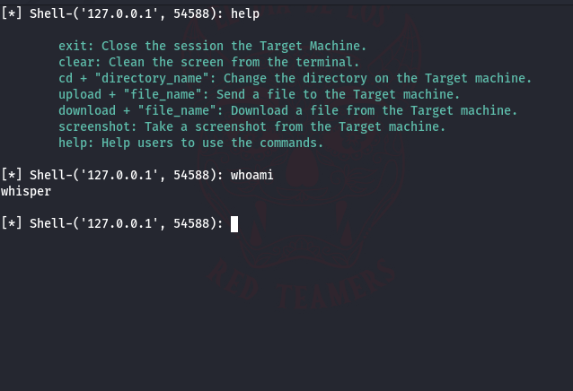

# C2-backdoor

<br/>
<p align="center">
  <a href="https://github.com/errorfiathck">
    
  </a>

  <h3 align="center">C&C Backdoor </h3>

  <p align="center">
    A simple C&C(c2) backdoor written in Python
    <br/>
    Note this project is`t done...
    <br/>
    <br/>
    <a href="https://intsagram.com/error._.fiat">My instagram page</a>
    .
    <a href="https://youtube.com/error_fiat">My youtube chanel</a>
    .
    <a href="https://t.me/hack_authenticator">My telegram chanel</a>
  </p>
</p>

## What is command and control (C2) in cybersecurity?

The security department in organizations uses a command-and-control system to monitor its security network, identify and respond to potential threats, and communicate with its team. NIST defines C2 as:

“…the exercise of authority and direction by a properly designated commander over assigned and attached forces in the accomplishment of the mission. Command and control functions are performed through an arrangement of personnel, equipment, communications, facilities, and procedures employed by a commander in planning, directing, coordinating, and controlling forces and operations in the accomplishment of the mission.”

Once an adversary compromises a C2 system, they can initiate additional malware downloads, steal sensitive company data such as financial documents and passwords, and even take down your entire company network.

Suppose you do not have strong command and control. In this case, your organization may suffer severe consequences such as financial loss, reputational damage and possible legal consequences. To prevent these attacks, your security teams must take a proactive approach to cybersecurity and implement strong command and control. You can do this using some top methods like:

- Keep the software up to date
- Implement strong access controls
- Using encryption
- Monitor the network for unusual activity.

+ Pro tip: You can use advanced technologies like AI and ML to identify and respond to threats in real time.

## How C2 attacks work

A C2 attack is a cyberattack that allows an attacker to take control of a compromised machine and use it to carry out malicious activities. 

In this attack, the attacker creates a communication channel between the infected machine and a command and control server. The communication channel then transmits instructions and data to the infected machine. Here's how a C2 attack is executed: 

- The adversaries will establish their foot in the targeted machine to initiate their attack. They can achieve this by phishing emails, social engineering, or exploiting vulnerabilities in software or operating systems. 
- Once they have access to the targeted machine, they will attempt to install malware or other malicious software that will allow them to gain control over the machine.
- The attackers will now build a communication line between the infected machine and the command and control server. They might use a Remote Access Trojan (RAT), a type of malware that lets you remotely control a compromised machine.
- Once the communication channel is built, the infected machine will signal the attacker's server to initiate malicious activity. 
This is how attackers can steal any essential data. They use this communication channel to pull out data from the compromised machine or to issue commands to carry out further malicious activities, such as launching a distributed denial-of-service (DDoS) attack.


## Installation:
```
> git clone https://github.com/errorfiathck/C2-backdoor

> cd C2-backdoor

> pip3 install -r requirements.txt
```

## Use:
| COMMAND | DESCRIPTION |
| ------------- | ------------- |
| help | Help users to use the commands.  |
| cd  | Change the directory on the Target machine.  |
| clear  | Clean the screen from the terminal.  |
| upload  | Send a file to the Target machine.  |
| download  | Download a file from the Target machine. |
| screenshot  | Take a screenshot from the Target machine.  |
| exit  | Close the session the Target Machine.  |



* Note Definitely, this simple model will be updated and maybe one day I will work very seriously. 

Have a good time.
